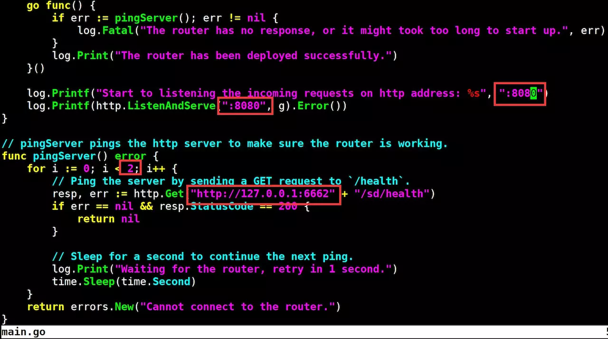
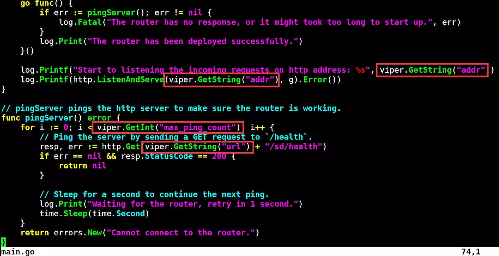
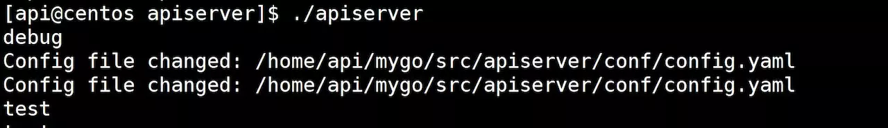

# 配置文件读取
本小节源码下载路径：[demo02](https://github.com/lexkong/apiserver_demos/tree/master/demo02)，
是基于 [demo01](https://github.com/lexkong/apiserver_demos/tree/master/demo01) 来开发的。

## Viper
[Viper](https://github.com/spf13/viper)是国外大神 spf13 编写的开源配置解决方案。特性：
- 设置默认值
- 可以读取如下格式的配置文件：JSON、TOML、YAML、HCL
- 监控配置文件改动，并热加载配置文件
- 从环境变量读取配置
- 从远程配置中心读取配置（etcd/consul），并监控变动
- 从命令行 flag 读取配置
- 从缓存中读取配置
- 支持直接设置配置项的值

Viper 配置读取顺序：

- `viper.Set()`所设置的值
- 命令行 flag
- 环境变量
- 配置文件
- 配置中心：`etcd/consul`
- 默认值

Viper 用起来很方便，在初始化配置文件后，读取配置只需要调用`viper.GetString()`、`viper.GetInt()`和`viper.GetBool()`等函数即可。
Viper 也可以非常方便地读取多个层级的配置，比如这样一个 YAML 格式的配置：
```yaml
 common:
   database:
     name: test
     host: 127.0.0.1
```
如果要读取 host 配置，执行`viper.GetString("common.database.host")`即可。

## 初始化配置
### 主函数中增加配置初始化入口
```go
 package main

 import (
 	"errors"
 	"log"
 	"net/http"
 	"time"

 	"apiserver/config"

 	 ...

 	"github.com/spf13/pflag"
 )

 var (
 	cfg = pflag.StringP("config", "c", "", "apiserver config file path.")
 )

 func main() {
 	pflag.Parse()

 	// init config
 	if err := config.Init(*cfg); err != nil {
 		panic(err)
 	}

 	// Create the Gin engine.
 	g := gin.New()

 	...
 }
```

`main`函数中增加了`config.Init(*cfg)`调用，用来初始化配置，`cfg`变量值从命令行 flag 传入，可以传值，比如`./apiserver -c config.yaml`，
也可以为空，如果为空会默认读取`conf/config.yaml`。

### 解析配置
`main`函数通过`config.Init`函数来解析并 watch 配置文件，`config.go`源码为：
```go
 package config

 import (
 	"log"
 	"strings"

 	"github.com/fsnotify/fsnotify"
 	"github.com/spf13/viper"
 )

 type Config struct {
 	Name string
 }

 func Init(cfg string) error {
 	c := Config {
 		Name: cfg,
 	}

 	// 初始化配置文件
 	if err := c.initConfig(); err != nil {
 		return err
 	}

 	// 监控配置文件变化并热加载程序
 	c.watchConfig()

 	return nil
 }

 func (c *Config) initConfig() error {
 	if c.Name != "" {
 		viper.SetConfigFile(c.Name) // 如果指定了配置文件，则解析指定的配置文件
 	} else {
 		viper.AddConfigPath("conf") // 如果没有指定配置文件，则解析默认的配置文件
 		viper.SetConfigName("config")
 	}
 	viper.SetConfigType("yaml") // 设置配置文件格式为YAML
 	viper.AutomaticEnv() // 读取匹配的环境变量
 	viper.SetEnvPrefix("APISERVER") // 读取环境变量的前缀为APISERVER
 	replacer := strings.NewReplacer(".", "_")
 	viper.SetEnvKeyReplacer(replacer)
 	if err := viper.ReadInConfig(); err != nil { // viper解析配置文件
 		return err
 	}

 	return nil
 }

 // 监控配置文件变化并热加载程序
 func (c *Config) watchConfig() {
 	viper.WatchConfig()
 	viper.OnConfigChange(func(e fsnotify.Event) {
 		log.Printf("Config file changed: %s", e.Name)
 	})
 }
```

`config.Init()`通过`initConfig()`函数来解析配置文件，通过`watchConfig()`函数`watch`配置文件，两个函数解析如下：
1. `func (c *Config) initConfig() error`
设置并解析配置文件。如果指定了配置文件`*cfg`不为空，则解析指定的配置文件，否则解析默认的配置文件`conf/config.yaml`。通过指定配置文件可以很方便地
连接不同的环境（开发环境、测试环境）并加载不同的配置，方便开发和测试。

通过如下设置
```go
viper.AutomaticEnv()
viper.SetEnvPrefix("APISERVER")
replacer := strings.NewReplacer(".", "_")
```
可以使程序读取环境变量，具体效果稍后会演示。

`config.Init`函数中的`viper.ReadInConfig()`函数最终会调用 Viper 解析配置文件。

2. `func (c *Config) watchConfig()`

通过该函数的`viper`设置，可以使`viper`监控配置文件变更，如有变更则热更新程序。所谓热更新是指：可以不重启 API 进程，使 API 加载最新配置项的值。

## 配置并读取配置
API 服务器端口号可能经常需要变更，API 服务器启动时间可能会变长，自检程序超时时间需要是可配的（通过设置次数），另外 API 需要根据不同的开发模式
（开发、生产、测试）来匹配不同的行为。开发模式也需要是可配置的，这些都可以在配置文件中配置，新建配置文件`conf/config.yaml`（默认配置文件名字固定
为 config.yaml），config.yaml 的内容为：
```yaml
runmode: debug               # 开发模式, debug, release, test
addr: :6663                  # HTTP绑定端口
name: apiserver              # API Server的名字
url: http://127.0.0.1:6663   # pingServer函数请求的API服务器的ip:port
max_ping_count: 10           # pingServer函数尝试的次数
```
在`main`函数中将相应的配置改成从配置文件读取，需要替换的配置见下图中红框部分。


替换后，代码为：


另外根据配置文件的`runmode`调用`gin.SetMode`来设置`gin`的运行模式：
```go
func main() {
    pflag.Parse()

    // init config
    if err := config.Init(*cfg); err != nil {
        panic(err)
    }

    // Set gin mode.
    gin.SetMode(viper.GetString("runmode"))

    ....

}
```
`gin`有 3 种运行模式：`debug`、`release`和`test`，其中`debug`模式会打印很多`debug`信息。

接下里就可以编译运行。

## Viper 高级用法
### 从环境变量读取配置
Viper 可以从环境变量读取配置，这是个非常有用的功能。现在越来越多的程序是运行在 Kubernetes 容器集群中的，在 API 服务器迁移到容器集群时，
可以直接通过 Kubernetes 来设置环境变量，然后程序读取设置的环境变量来配置 API 服务器。
例如，通过环境变量来设置 API Server 端口：
```bash
$ export APISERVER_ADDR=:7777
$ export APISERVER_URL=http://127.0.0.1:7777
$ ./apiserver
[GIN-debug] [WARNING] Running in "debug" mode. Switch to "release" mode in production.
 - using env:	export GIN_MODE=release
 - using code:	gin.SetMode(gin.ReleaseMode)

[GIN-debug] GET    /sd/health                --> apiserver/handler/sd.HealthCheck (5 handlers)
[GIN-debug] GET    /sd/disk                  --> apiserver/handler/sd.DiskCheck (5 handlers)
[GIN-debug] GET    /sd/cpu                   --> apiserver/handler/sd.CPUCheck (5 handlers)
[GIN-debug] GET    /sd/ram                   --> apiserver/handler/sd.RAMCheck (5 handlers)
Start to listening the incoming requests on http address: :7777
The router has been deployed successfully.
```
从输出可以看到，设置`APISERVER_ADDR=:7777`和`APISERVER_URL=http://127.0.0.1:7777`后，启动 apiserver，API 服务器的端口变为`7777`。

环境变量名格式为`config/config.go`文件中`viper.SetEnvPrefix("APISERVER")`所设置的前缀和配置名称大写，二者用`_`连接，比如`APISERVER_RUNMODE`。
如果配置项是嵌套的，情况可类推，比如：
```yaml
....
max_ping_count: 10           # pingServer函数try的次数
db:
  name: db_apiserver
```
对应的环境变量名为`APISERVER_DB_NAME`。

### 热更新
在`main`函数中添加如下测试代码（`for {}`部分，循环打印`runmode`的值）：
```go
import (
    "fmt"
    ....
)

var (
    cfg = pflag.StringP("config", "c", "", "apiserver config file path.")
)

func main() {
    pflag.Parse()

    // init config
    	if err := config.Init(*cfg); err != nil {
    	panic(err)
    }

    for {
        fmt.Println(viper.GetString("runmode"))
        time.Sleep(4*time.Second)
    }
    ....
}
```
编译并启动 apiserver 后，修改配置文件中`runmode`为`test`，可以看到`runmode`的值从`debug`变为`test`：
