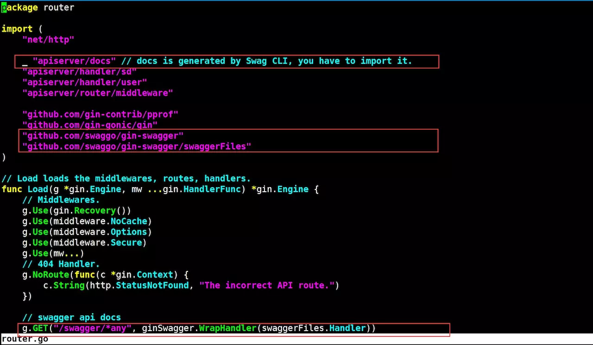

# 生成 Swagger 在线文档
本小节源码下载路径：[demo17](https://github.com/lexkong/apiserver_demos/tree/master/demo17)

## 背景
开发 API 服务，API 文档必不可少，很多人选择手写 API 文档，手写 API 文档有很多问题，比如工作量大、手写容易出错、更新麻烦、格式不固定、维护困难等。所以在实际的开发中，
建议自动生成 API 文档。

本小册所用的 API 服务器 RESTful 框架采用的是 gin，gin 在 GitHub 上有很多 middleware 可用，其中就有可以自动生成 Swagger 文档的`gin-swagger` middleware。

## Swagger 配置步骤
我们用 [gin-swagger](https://github.com/swaggo/gin-swagger) gin middleware来生成 Swagger API 文档。步骤如下：

- 安装 swag 命令
```bash
$ mkdir -p $GOPATH/src/github.com/swaggo
$ cd $GOPATH/src/github.com/swaggo
$ git clone https://github.com/swaggo/swag
$ cd swag/cmd/swag/
$ go install -v
```

> 因为该包引用`golang.org`中的包，而网络环境原因，一般很难连上`golang.org`，所以这里不采用`go get`方式安装。

2. 进入 apiserver 根目录执行`swag init`
```bash
$ cd $GOPATH/src/apiserver
$ swag init
```

3. 下载`gin-swagger`
```bash
$ cd $GOPATH/src/github.com/swaggo
$ git clone https://github.com/swaggo/gin-swagger
```

4. 在`router/router.go`中添加`swagger`路由
（详见 [demo17/router/router.go](https://github.com/lexkong/apiserver_demos/blob/master/demo17/router/router.go)）


5. 编写 API 注释，Swagger 中需要将相应的注释或注解编写到方法上，再利用生成器自动生成说明文件
这里用创建用户 API 来举例，其它 API 请参考
[demo17/handler/user](https://github.com/lexkong/apiserver_demos/tree/master/demo17/handler/user) 下的 API 文件。
```go
package user

import (
    ...
)


// @Summary Add new user to the database
// @Description Add a new user
// @Tags user
// @Accept  json
// @Produce  json
// @Param user body user.CreateRequest true "Create a new user"
// @Success 200 {object} user.CreateResponse "{"code":0,"message":"OK","data":{"username":"kong"}}"
// @Router /user [post]
func Create(c *gin.Context) {
    ...
}
```

6. 执行`swag init`，在 apiserver 根目录下生成`docs`目录
```bash
$ swag init
```

### 文档语法说明

- Summary：简单阐述 API 的功能
- Description：API 详细描述
- Tags：API 所属分类
- Accept：API 接收参数的格式
- Produce：输出的数据格式，这里是 JSON 格式
- Param：参数，分为 6 个字段，其中第 6 个字段是可选的，各字段含义为：
  1. 参数名称
  2. 参数在 HTTP 请求中的位置（body、path、query）
  3. 参数类型（string、int、bool 等）
  4. 是否必须（true、false）
  5. 参数描述
  6. 选项，这里用的是 default() 用来指定默认值
- Success：成功返回数据格式，分为 4 个字段
  1. HTTP 返回 Code
  2. 返回数据类型
  3. 返回数据模型
  4. 说明
- 路由格式，分为 2 个字段：
  1. API 路径
  2. HTTP 方法

> API 文档编写规则请参考 [See Declarative Comments Format](https://swaggo.github.io/swaggo.io/declarative_comments_format/)。
> API 文档有更新时，要重新执行 swag init 并重新编译 apiserver。

## 查看文档
编译执行`./apiserver`启动 apiserver 后，在浏览器中打开：`http://localhost:8080/swagger/index.html`访问 Swagger 2.0 API文档。