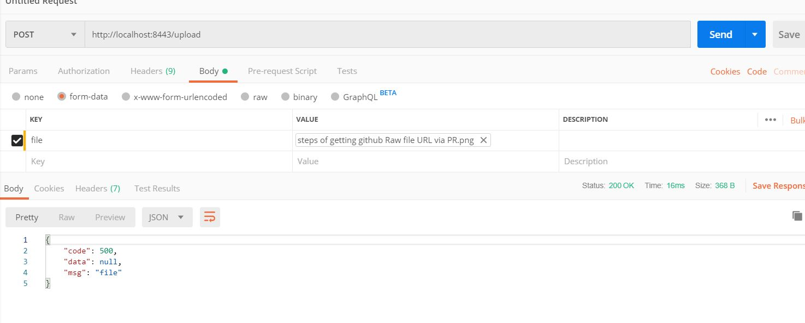
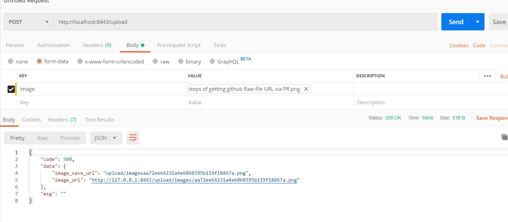

# 实现文件上传下载
## 上传文件
使用 Gin 实现文件上传非常简单：
```go
func uploadFile(c *gin.Context)  {
	file, _ := c.FormFile("file") // 这里的 key: file 要根据你前端上传文件的字段改变
	fmt.Println(file.Filename, file.Header, file.Size)
	// 复制文件到指定目标
	_ = c.SaveUploadedFile(file, file.Filename)

	c.JSON(http.StatusOK, gin.H{
		"code": 500,
		"msg":  "file",
		"data": nil,
	})
}
```

添加路由：
```go
g := gin.New()
g.POST("/upload", uploadFile)
```

`postman` 模拟上传：


然后就可以在当前目录找到你上传的文件。

### 上传图片示例
添加路由：
```go
g.POST("/upload", uploadImage)
```

`uploadImage` handler：
```go
func uploadImage(c *gin.Context) {
	data := make(map[string]string)
    // 这里应该封装自己的 业务错误信息
    code := 500
    errMsg := ""
	file, image, err := c.Request.FormFile("image") // 这里的 key: image 要根据你前端上传文件的字段改变
	if err != nil {
		fmt.Println(err)
		c.JSON(http.StatusOK, gin.H{
			"code": 500,
			"msg":  "fail",
			"data": data,
		})
	}

	if image == nil {
		code = 400
	} else {
		imageName := upload.GetImageName(image.Filename)
		fullPath := upload.GetImageFullPath()
		savePath := upload.GetImagePath()

		src := fullPath + "/" + imageName
		if !upload.CheckImageExt(imageName) || !upload.CheckImageSize(file) {
			// 检查图片失败
			fmt.Println("error: ", err)
			errMsg = err.Error()
			code = 30002
		} else {
			err := upload.CheckImage(fullPath)
			if err != nil {
				// 校验图片错误，图片格式或大小有问题
				fmt.Println("error: ", err)
				errMsg = err.Error()
				code = 30003
			} else if err := c.SaveUploadedFile(image, src); err != nil {
				// 保存图片失败
				fmt.Println("error: ", err)
				errMsg = err.Error()
				code = 30001
			} else {
				data["image_url"] = upload.GetImageFullUrl(imageName)
				data["image_save_url"] = savePath + "/" + imageName
			}
		}
	}

	c.JSON(http.StatusOK, gin.H{
		"code": code,
		"msg":  errMsg,
		"data": data,
	})
}
```

`upload` 包：
```go
package upload

import (
	"crypto/md5"
	"encoding/hex"
	"fmt"
	"io/ioutil"
	"log"
	"mime/multipart"
	"os"
	"path"
	"strings"
)

// 下面的变量实际开发中，可以放到配置文件中，使其可配置
var (
	ImagePrefixUrl  = "http://127.0.0.1:8443"
	ImageSavePath   = "upload/images"

	ImageMaxSize    = 5 // MB
	ImageAllowExts  = []string{
		".jpg",
		".jpeg",
		".png",
	}
)

// 上传的图片名用 MD5 转换为新的字符串，避免保罗
func EncodeMD5(value string) string {
	m := md5.New()
	m.Write([]byte(value))
	return hex.EncodeToString(m.Sum(nil))
}

func GetImageFullUrl(name string) string {
	return ImagePrefixUrl + "/" + GetImagePath() + "/" + name
}

func GetImageName(name string) string {
	ext := path.Ext(name)
	fileName := strings.TrimSuffix(name, ext)
	fileName = EncodeMD5(fileName)

	return fileName + ext
}

func GetImagePath() string {
	return ImageSavePath
}

func GetImageFullPath() string {
	return GetImagePath()
}

func CheckImageExt(fileName string) bool {
	ext := path.Ext(fileName)
	for _, allowExt := range ImageAllowExts {
		if strings.ToUpper(allowExt) == strings.ToUpper(ext) {
			return true
		}
	}

	return false
}

func CheckImageSize(f multipart.File) bool {
	content, err := ioutil.ReadAll(f)
	if err != nil {
		log.Println(err)
		return false
	}
	size := len(content)
	return size <= (ImageMaxSize * 1024 * 1024) // size 的单位是 byte
}

func CheckImage(src string) error {
	dir, err := os.Getwd()
	if err != nil {
		return fmt.Errorf("os.Getwd err: %v", err)
	}

	err = IsNotExistMkDir(dir + "/" + src)
	if err != nil {
		return fmt.Errorf("file.IsNotExistMkDir err: %v", err)
	}

	perm := CheckPermission(src)
	if perm == true {
		return fmt.Errorf("file.CheckPermission Permission denied src: %s", src)
	}

	return nil
}

// CheckNotExist check if the file exists
func CheckNotExist(src string) bool {
	_, err := os.Stat(src)

	return os.IsNotExist(err)
}

// MkDir create a directory
func MkDir(src string) error {
	err := os.MkdirAll(src, os.ModePerm)
	if err != nil {
		return err
	}

	return nil
}

// IsNotExistMkDir create a directory if it does not exist
func IsNotExistMkDir(src string) error {
	if notExist := CheckNotExist(src); notExist == true {
		if err := MkDir(src); err != nil {
			return err
		}
	}

	return nil
}

// CheckPermission check if the file has permission
func CheckPermission(src string) bool {
	_, err := os.Stat(src)

	return os.IsPermission(err)
}
```

`postman` 模拟上传：


然后就可以在当前目录的 `upload/images` 查看文件是否上传成功。

### 多文件上传
```go
// 设置可以上传 multipart 表单的最大体积（默认为 32MiB）
// g.MaxMultipartMemory = 8 << 20  // 8 MiB
g.POST("/upload", uploadMutiFiles)

func uploadMutiFiles(c *gin.Context) {
	// 设置文件大小
	err := c.Request.ParseMultipartForm(4 << 20)

	if err != nil {
		c.JSON(http.StatusBadRequest, gin.H{"msg": "file size is too large"})
		return
	}
	formdata, _ := c.MultipartForm()
	files := formdata.File["file"]

	for _, v := range files {
        log.Println(file.Filename)
        // Do someting
	}

	c.JSON(http.StatusOK, gin.H{"msg": fmt.Sprintf("%d files uploaded!", len(files))})
}
```

验证：
```sh
curl -X POST http://localhost:8080/upload \
  -F "file=@/Users/appleboy/test1.zip" \
  -F "file=@/Users/appleboy/test2.zip" \
  -H "Content-Type: multipart/form-data"
```
## 文件下载
利用 `Context.File` 方法可以实现文件下载：
```go
g.GET("/file", func(c *gin.Context) {
    filename := "xxx.png"
    // Content-Disposition 设置文件名字
	c.Writer.Header().Add("Content-Disposition", fmt.Sprintf("attachment; filename=%s", filename))
    c.Writer.Header().Add("Content-Type", "application/octet-stream")
    c.File(filepath.Join(currentPath, "./xxx.png"))
})
```
或者：
```go
func downloadFile(c *gin.Context) {
	content := c.Query("content")

	content = "download file" + content

	c.Writer.WriteHeader(http.StatusOK)
    // Content-Disposition 设置文件名字
	c.Header("Content-Disposition", "attachment; filename=hello.txt")
	c.Header("Content-Type", "text/plain")
	c.Header("Accept-Length", fmt.Sprintf("%d", len(content)))
	c.Writer.Write([]byte(content))
}
```

或者配置静态文件目录：
```go
g.StaticFS("/upload/images", http.Dir(upload.GetImageFullPath()))
```

这样可以直接通过路径访问文件。